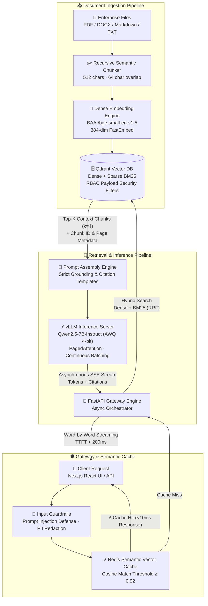

# 🧠 Enterprise Private Document Intelligence Engine

> **High-throughput on-premises RAG engine powered by vLLM (PagedAttention), Qdrant Hybrid Vector Search, Redis Semantic Cache, and Next.js Streaming UI.**

[](https://fastapi.tiangolo.com/)
[](https://github.com/vllm-project/vllm)
[](https://qdrant.tech/)
[](https://redis.io/)
[](https://nextjs.org/)
[](https://docs.docker.com/compose/)
[](LICENSE)

---

### 🎬 System Demo & Visual Preview

https://github.com/user-attachments/assets/263917d8-cd22-4679-81a1-d5fe9b71150f

*Watch document ingestion, hybrid chunk retrieval, sub-10ms Redis cache hits, and real-time word-by-word token streaming with grounded citations.*

---

## 📌 Executive Summary

This repository implements a production-grade, air-gapped **Private Document Intelligence Engine** designed for strict enterprise privacy constraints. Organizations can index proprietary documents (policy manuals, technical documentation, compliance reports, financial statements) and query them through a low-latency natural language interface with exact source citations.

### 🛡️ Core Engineering Principles
- **Zero Third-Party AI Dependencies:** Runs 100% locally and on-premises. No tokens or sensitive document payloads ever egress to OpenAI, Anthropic, or external cloud endpoints.
- **High-Throughput Inference:** Leverages **vLLM** with **PagedAttention** and AWQ 4-bit quantization, minimizing KV-cache memory fragmentation to near 0% while serving concurrent queries.
- **Hybrid Retrieval Precision:** Blends dense semantic embeddings (`BAAI/bge-small-en-v1.5`) with sparse lexical tokens (`BM25`) using Reciprocal Rank Fusion (RRF) and metadata Role-Based Access Control (RBAC).
- **Sub-10ms Semantic Caching:** Utilizes Redis Vector Similarity to instantly intercept previously answered or paraphrased enterprise questions without invoking vector search or LLM compute.

---

## 🏗️ System Architecture



---

## 📊 Engineering Specifications & Benchmarks

| Component | Technology / Metric | Specification & Operational Performance |
| :--- | :--- | :--- |
| **Inference Engine** | `vLLM v0.6.1` | PagedAttention KV-Cache, continuous batching, prefix caching |
| **Base LLM** | `Qwen/Qwen2.5-7B-Instruct-AWQ` | 4-Bit Activation-aware Weight Quantization (~5 GB VRAM vs 14 GB FP16) |
| **Generation Throughput** | **> 50 tokens/sec** | Single GPU · Continuous batching eliminates idle GPU bubbles |
| **Time-to-First-Token (TTFT)** | **< 200 ms** | FastAPI asynchronous SSE stream dispatch |
| **Vector Retrieval** | Qdrant Hybrid Collection | Dense (BGE-small 384d) + Sparse BM25 via Reciprocal Rank Fusion (RRF) |
| **Retrieval Latency** | **< 35 ms** | Filtered ANN vector search on indexed chunks ($k=4$) |
| **Semantic Cache** | Redis 7 Vector Index | Cosine similarity match $\ge 0.92$ · Sub-10ms response time |
| **Chunking Strategy** | Recursive Splitter | 512 character chunk size · 64 character overlap · boundary preservation |
| **Security & RBAC** | Payload Metadata Filters | Department & clearance-level isolation + Prompt injection sanitization |
| **Frontend Dashboard** | Next.js 14 / React | Dark mode UI, token streaming, interactive citation inspector |
| **Containerization** | Docker Compose | Multi-tier orchestration (vLLM, Qdrant, Redis, FastAPI, Next.js) |

---

## 🚀 Quickstart Guide

### Option 1: Full-Stack Docker Compose *(Recommended)*

Clone the repository and launch the containerized ecosystem:

```bash
# 1. Clone repo
git clone https://github.com/manthnnnn/VLLM-RAG.git
cd VLLM-RAG

# 2. Configure Environment
cp .env.example .env

# 3. Launch the full stack (Runs in CPU/Demo Mode if GPU is unavailable)
docker compose up --build
```

### Option 2: GPU-Accelerated vLLM Profile

For environments with NVIDIA GPUs (CUDA $\ge$ 12.1):

```bash
# Boot the stack including the dedicated vLLM GPU inference container
docker compose --profile gpu up --build
```

> **GPU Profile Details:** Automatically provisions `vllm/vllm-openai:v0.6.1.post2` with `Qwen2.5-7B-Instruct-AWQ`, 85% GPU memory allocation, and 4096 context length.

### Option 3: Local Development (Windows / PowerShell)

```powershell
# Run the automated local runner script
.\start_local.ps1
```

---

## 🌐 Service Access & Endpoints

| Service | Port | Local Endpoint | Description |
| :--- | :--- | :--- | :--- |
| 🖥️ **Next.js Web UI** | `3000` | [http://localhost:3000](http://localhost:3000) | Modern interactive chat UI with source citations |
| 📡 **FastAPI Gateway** | `8080` | [http://localhost:8080/docs](http://localhost:8080/docs) | Interactive OpenAPI / Swagger documentation |
| 🗄️ **Qdrant Vector DB** | `6333` | [http://localhost:6333/dashboard](http://localhost:6333/dashboard) | Qdrant Web UI & collection manager |
| ⚡ **Redis Semantic Cache** | `6379` | `localhost:6379` | In-memory semantic vector cache & session store |
| 🤖 **vLLM Inference Server** | `8000` | [http://localhost:8000/v1/models](http://localhost:8000/v1/models) | OpenAI-compatible local model inference server |

---

## 🔬 Pipeline Deep-Dive

### 1. Document Ingestion & Chunking
- Documents (`.pdf`, `.docx`, `.md`, `.txt`) are parsed and partitioned using `RecursiveCharacterTextSplitter`.
- **Chunk Geometry:** 512 characters per chunk with 64-character sliding overlap to prevent context clipping at sentence boundaries.
- **Metadata Tagging:** Every chunk is injected with payload attributes: `file_name`, `page_number`, `department`, `classification_level`.

### 2. Hybrid Retrieval (Dense + Sparse)
```
Query
  ├── Dense: BAAI/bge-small-en-v1.5 (384-dimensional vector)
  └── Sparse: BM25 Tokenizer (Exact keyword matches)
         │
         ▼
  Qdrant Hybrid Search (Reciprocal Rank Fusion) + RBAC Filter
         │
         ▼
  Top-4 Context Chunks with Relevance Scores
```

### 3. Redis Semantic Vector Cache
- Incoming queries are embedded on the fly.
- Redis vector index searches prior query embeddings.
- If similarity score $\ge 0.92$, the cached response is served in **< 10ms**, bypassing Qdrant search and vLLM inference completely.

### 4. Grounded vLLM Token Generation
- Retrieved chunks are structured into a strict system prompt that mandates citation bracket tags (e.g. `[CHUNK-1]`).
- vLLM processes the assembled prompt using **PagedAttention** and streams tokens via Server-Sent Events (SSE).

---

## 🧪 Evaluation & Benchmarking Suite

The repository includes synthetic data seeding and evaluation tools:

```bash
# 1. Seed Qdrant with enterprise policies (HR, IT Security, Finance)
python scripts/seed_data.py

# 2. Run synthetic RAG precision & faithfulness evaluation
python scripts/eval_rag.py

# 3. Execute concurrent load & TTFT throughput benchmark
python scripts/benchmark.py
```

---

## 📁 Repository Structure

```
VLLM-RAG/
├── app/                        # FastAPI Backend Application
│   ├── main.py                 # API endpoints & SSE streaming handler
│   ├── config.py               # Pydantic environment configuration
│   ├── core/                   # Text splitters, embeddings, guardrails
│   ├── services/               # Qdrant client, Redis cache, vLLM connector
│   └── models/                 # Pydantic schemas for requests & responses
├── frontend-node/              # Primary Next.js 14 React Dashboard
│   ├── app/                    # Next.js App Router (layout, page)
│   └── package.json            # Frontend dependencies
├── frontend/                   # Streamlit Frontend (legacy alternative)
├── scripts/
│   ├── seed_data.py            # Sample data ingestion script
│   ├── eval_rag.py             # Precision & recall evaluation suite
│   ├── benchmark.py            # Async load test & throughput script
│   └── start_vllm.sh           # vLLM standalone launch script
├── docker-compose.yml          # Production multi-container composition
├── Dockerfile                  # FastAPI backend Docker image
├── requirements.txt            # Python dependencies
└── start_local.ps1             # Local Windows development startup script
```

---

## 🧠 Technical Interview Reference & Architecture Q&A

### Q1: Why use vLLM over standard Hugging Face `pipeline` or Ollama?
> **Answer:** Standard Hugging Face pipelines allocate static, contiguous memory blocks for Key-Value (KV) caches, leading to **60–80% memory waste** due to internal and external fragmentation. vLLM implements **PagedAttention**, which manages KV caches in non-contiguous physical memory pages (analogous to virtual memory in operating systems). This brings memory waste down to near **0%** and unlocks **continuous batching**, allowing dynamic insertion of incoming queries without waiting for existing batch generations to finish. Ollama is typically tuned for single-stream desktop workloads, whereas vLLM is architected for high-concurrency enterprise serving.

### Q2: How do you prevent hallucinations and handle chunk boundary context loss?
> **Answer:** 
> 1. **Sliding Overlap:** A 512-character chunk with a 64-character overlap ensures linguistic continuity across boundaries.
> 2. **Hybrid Search (Dense + BM25):** Dense vectors capture semantic intent while BM25 guarantees precision for exact policy codes, product IDs, and legal identifiers.
> 3. **Constrained Prompting:** The system prompt restricts answers strictly to the provided context chunks and enforces mandatory chunk citations (`[CHUNK_ID]`). If context is insufficient, the model is instructed to explicitly acknowledge the gap.

### Q3: What is the system's memory footprint and cold-start profile?
> **Answer:**
> - **vLLM Weights (Qwen2.5-7B AWQ):** ~5 GB GPU VRAM.
> - **KV-Cache Pool:** Configured at 85% GPU memory allocation (`--gpu-memory-utilization 0.85`).
> - **Embedding Model:** `bge-small-en-v1.5` consumes ~90 MB RAM on CPU via `fastembed`.
> - **Redis Cache:** Bounded to 512 MB with `allkeys-lru` eviction policy.
> - **Cold Start:** Model weights load in 45–60 seconds; subsequent queries achieve $<200\text{ms}$ TTFT.

### Q4: Why Qdrant over ChromaDB or Pinecone?
> **Answer:** Qdrant is fully open-source and self-hostable (essential for air-gapped data compliance). It provides **native hybrid search** (dense vectors + sparse BM25 vectors in a single query with Reciprocal Rank Fusion) and supports hardware-accelerated **payload-level RBAC filtering** directly within the indexing engine.

### Q5: How does the Redis Semantic Cache differ from standard key-value caching?
> **Answer:** Standard key-value caches rely on exact hash matches (`query == cached_query`), failing whenever a user rephrases a question. The Redis Semantic Cache creates a vector embedding of incoming queries and performs an approximate nearest neighbor (ANN) vector similarity search. Queries with cosine similarity $\ge 0.92$ return instantly ($<10\text{ms}$), significantly improving cache hit rates across enterprise terminology variations.

---

## 🛠️ Technology Stack Summary

| Domain | Technology |
| :--- | :--- |
| **Inference Server** | vLLM (PagedAttention, AWQ Quantization, Continuous Batching) |
| **Base Model** | Qwen/Qwen2.5-7B-Instruct-AWQ |
| **Vector Database** | Qdrant (Hybrid Dense/Sparse Search + RBAC Payload Filters) |
| **Embedding Engine** | BAAI/bge-small-en-v1.5 (FastEmbed ONNX Runtime) |
| **Semantic Cache** | Redis 7 (Vector Similarity Search) |
| **Backend Framework** | FastAPI (Async endpoints, Server-Sent Events SSE) |
| **Frontend UI** | Next.js 14 (React, App Router, Tailwind CSS) |
| **Containerization** | Docker, Docker Compose |
| **Monitoring** | Prometheus metrics, Loguru structured logging |

---

## 📜 License

Distributed under the MIT License. See [LICENSE](LICENSE) for details.
